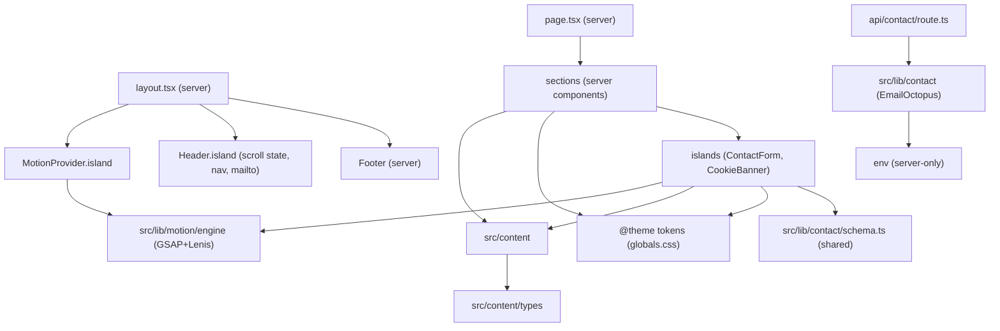

# Architecture Spine — Glitch-guy0

## Design Paradigm

**Island architecture.** The page is fully server-rendered content with small, isolated client components ("islands") mounted on top for the three places that genuinely need interactivity — motion, the contact form, and cookie consent. Content is baked at build; nothing on the page fetches at runtime. This keeps the page static and fast (the site *is* the demo), and makes the client bundle small and predictable.

| Layer | Responsibility | Home |
| --- | --- | --- |
| Content | All copy, from resume.md + PRD-approved sets | `src/content/` |
| Tokens | Design system values, one declaration each | `src/styles/globals.css` (`@theme`) |
| Sections | Server-rendered page composition | `src/components/` |
| Islands | Interactive leaves: Motion, ContactForm, CookieBanner, Header | `src/components/*/island` (marked `"use client"`) |
| lib | Pure logic only — no React: motion engine, contact service, env access | `src/lib/` |
| Route | `POST /api/contact` (the only runtime code) | `src/app/api/contact/route.ts` |

## Invariants & Rules

Dependency direction is a rule. No module may point inward across its layer; leaves (`content`, `tokens`, `lib/*`, `env`) never depend on components:



Server sections never import island internals — only mount them. Islands may import the shared validation schema from `lib/contact/schema.ts` but never the service (no env access). The contact route depends on `lib/contact` and env, never on components or content.

### AD-1 — Design tokens are the single source of visual truth

- **Binds:** all components, both color modes; DESIGN.md token block; PRD §9 (monochrome, no chromatic color)
- **Prevents:** hardcoded hex/RGB/px values diverging across independently-built components; a chromatic color or gradient leaking into the monochrome system
- **Rule:** Every visual value (colors, type roles, spacing, radii, breakpoints) is declared once as a Tailwind v4 `@theme` token in `src/styles/globals.css`. Tokens have **one name each**; light mode re-binds the same names to their light values under a light-theme selector — it never introduces `-light` as a second name set or adds colors. Component files contain zero raw design literals — only token utilities or `var(--token)` references. Adding a visual value is an addition to the token layer, never a local constant. `DESIGN.md`'s `*-light` entries are the light-mode *values* of the same roles, not additional roles.

### AD-2 — Motion is centralized and gated by one reduced-motion policy

- **Binds:** all animation and scroll behavior; glitch FX; EXPERIENCE.md Accessibility Floor; WCAG 2.1 AA
- **Prevents:** scattered GSAP tweens or CSS keyframes that ignore `prefers-reduced-motion` or glitch body text / form fields; two animation libraries fighting over one page
- **Rule:** All motion goes through `src/lib/motion/engine` + `MotionProvider.island`. The reduced-motion policy is **one policy implemented in two coordinated halves**: (1) a global CSS `@media (prefers-reduced-motion: reduce)` rule in `globals.css` disables every glitch keyframe outright (no jitter, no grayscale offset, no flicker), and (2) a single `gsap.matchMedia()` gate disables JS tweens and Lenis smoothing, leaving instant reveal and native scroll. The mobile ~30% intensity reduction is a single amplitude token, not per-component tuning. GSAP+Lenis integration details that bind: Lenis runs on the GSAP ticker with `autoRaf: false` and `lenis.raf(time * 1000)` (the GSAP ticker passes **seconds**), `gsap.ticker.lagSmoothing(0)`, `lenis.on('scroll', ScrollTrigger.update)`, and `ScrollTrigger.refresh()` after mount and after any layout-affecting change. Glitch keyframes are CSS, defined once in the styles layer: 100–400ms grayscale-offset + jitter with instant snap-back, never on body text, form fields, the contact form, or the page as a whole. No other animation library is added.

### AD-3 — The contact flow is a closed loop that never fails silently

- **Binds:** ContactForm island, `POST /api/contact`, EmailOctopus, contacts metric; FR-19..FR-24, FR-28; reliability & security NFRs
- **Prevents:** a submission lost without the visitor knowing; the EmailOctopus API key reaching the client; spam reaching the inbox; double-opt-in `PENDING` contacts silently never reaching the Builder; the contacts metric drifting from actual valid submissions
- **Rule:** Wire contract is pinned. Payload is `{ name, email, message }`; the response envelope is `{ ok: boolean, error?: string }`. One shared zod schema lives in `src/lib/contact/schema.ts` and is the **only** source of field rules — used by the server to validate and by the client for matching inline errors; client and server schemas can never drift. Flow: client validates → `POST /api/contact` → server re-validates with the shared schema → checks the honeypot (hidden field `website`; a filled honeypot returns `{ ok: true }` with no delivery — the request is a bot) → calls EmailOctopus **API v2** (`create-contact` with `status: "SUBSCRIBED"` and a source tag so the Builder can filter) → returns `{ ok: true }` or, on any failure, `{ ok: false, error }` with a non-2xx status. The client decides outcome by `body.ok`, never by HTTP status alone. The route is the only module reading `EMAIL_OCTOPUS_*` (server-only env). The contacts metric is the EmailOctopus list member count — each valid submission creates exactly one member; the Builder reads the count in the EmailOctopus dashboard. On failure the client preserves input, shows an accessible inline error, and offers retry without reload.

### AD-4 — All copy and content are single-sourced

- **Binds:** every section, the resume PDF, hero/offer/project/work-statement copy; FR-4, FR-6, FR-9, FR-10, FR-18, FR-26
- **Prevents:** hero, Services, Projects, Experience copy and the resume PDF drifting apart; copy re-typed into JSX strings where two builders could write two versions; an ambiguous source authority for a section
- **Rule:** All copy lives once in `src/content/` as typed data. Source authority is explicit: **the PRD-approved sets are canonical** for offers (three), featured projects + showcase, skill pills, and section structure; resume.md is the reference only for the hero headline/tagline and the Experience work statements (per PRD decisions 2026-08-06) — it is not a Services source. Sections render content only — no JSX string literals for content, no orphan microcopy (nav labels, form labels, button labels, aria text, success/error copy all trace to `src/content/`). The resume PDF is generated from the same content at build. Editing copy means editing the content module (or its upstream reference, then regenerating), never a component.

### AD-5 — Server-first; client islands sit at the boundary

- **Binds:** all components and the page shell; PRD performance NFR (Lighthouse ≥ 90 mobile)
- **Prevents:** the whole page shipping as a client bundle; server components importing client-only code; motion or fetch running on the server
- **Rule:** The page and all seven sections are server components by default. `"use client"` is limited to interactive islands: MotionProvider, Header (scroll state, nav), ContactForm, CookieBanner. Client islands never import server components, and server sections mount islands rather than importing their internals. `useGSAP` and all window/DOM access run only inside islands. The page performs zero client-side data fetching — content is baked at build.

### AD-6 — Analytics are consent-gated at a single surface

- **Binds:** Vercel Web Analytics, CookieBanner island; FR-27, FR-29; privacy guardrail
- **Prevents:** analytics running before consent; consent state and analytics initialization drifting apart; additional analytics scripts; a provider injection path that bypasses the consent gate
- **Rule:** Vercel Web Analytics is **cookieless** (day-scoped request hash) — the consent gate is a conservative tracking-privacy posture, not a cookie requirement. It initializes only after the visitor explicitly Accepts, persisted client-side under the single key `glitch-guy0:consent` with value `"accepted" | "declined"`. The CookieBanner is the sole owner of that key and the only consent surface; it never obstructs the Contact Flow. Injection is **app-code only** (`<Analytics />` from `@vercel/analytics`, mounted behind the consent state) — dashboard-level automatic injection is forbidden because it cannot be consent-gated. No analytics code runs outside production. No other analytics provider or tracking script is added without a decision. *(Note: PRD FR-29's premise that "Vercel Web Analytics uses cookies" is stale; the decision to gate stands, the rationale is corrected here.)*

### AD-7 — Static-first; no runtime data services

- **Binds:** the whole site; cost and privacy guardrails (§10 PRD)
- **Prevents:** a database, auth, or server-side session state sneaking into a static marketing site; breaking the "fast, working deployed site" demo
- **Rule:** The site renders fully static. No database, no auth, no server-side state. The only runtime state is transient client state (form submission + consent). All outbound external calls come from the `/api/contact` route only.

### AD-8 — Section identity and anchor contract

- **Binds:** the seven sections, header nav, FR-1 (anchored navigation, back-button compatibility), FR-2
- **Prevents:** nav and sections dead-linking (nav targets a name the section doesn't own); the browser back button breaking anchor jumps under Lenis smoothing
- **Rule:** Section `id`s are fixed and unique: `#hero`, `#services`, `#projects`, `#about`, `#skills`, `#experience`, `#contact` (top-of-page is `#top`). Nav items are real `<a href="#section">` anchors; the click handler smooth-scrolls via Lenis `scrollTo` but leaves the hash in the URL so back-button works. Any hash navigation fires `ScrollTrigger.refresh()` after the scroll settles. Header and footer render `mailto:` from the server-side `CONTACT_EMAIL` on every viewport (FR-2).

## Consistency Conventions

| Concern | Convention |
| --- | --- |
| Naming | Components PascalCase; islands carry an `Island` suffix and a top-of-file `"use client"`; content data camelCase typed in `src/content/`; route handler in `route.ts`; lib modules are pure (no React) |
| Data & formats | Contact payload `{ name, email, message }`; API envelope `{ ok, error? }`; dates ISO-8601; consent key `glitch-guy0:consent` (`"accepted" | "declined"`); form errors inline, injected into an `aria-live` region |
| State & cross-cutting | Errors are never swallowed — any failure surfaces to the visitor (FR-22); no secret in the client bundle; env vars follow `.env.example` (`EMAIL_OCTOPUS_API_KEY`, `EMAIL_OCTOPUS_LIST_ID` server-only, `CONTACT_EMAIL` read server-side and rendered into `mailto:` links — no `NEXT_PUBLIC_*` secrets); logging is console + Vercel, no extra tooling |
| Content sourcing | Every visible string traces to `src/content/`; review a section's rendered output against its content module |
| Accessibility & quality | Axe-core runs at build in both color modes; contrast pairs ≥ 4.5:1; focus rings ≥ 2px white; touch targets ≥ 44×44px; Lighthouse ≥ 90 mobile verified pre-launch |

## Stack

Seed — verified current at authoring (2026-08-06); the code owns exact versions once it exists. `[ASSUMPTION]` where the builder confirms at scaffold.

| Name | Version |
| --- | --- |
| Next.js (App Router) | current stable at scaffold — 16.x (15.x also current); scaffold with `npx create-next-app@latest --ts --tailwind --eslint --app --src-dir --turbopack` |
| React | latest stable with the scaffolded Next.js |
| TypeScript | strict mode on |
| Tailwind CSS | v4 — CSS-first (`@theme` in `globals.css`, no `tailwind.config` needed) |
| GSAP | 3.12+ (core + ScrollTrigger + `@gsap/react` `useGSAP`) |
| Lenis | 1.x — import `lenis/react` (`ReactLenis`), not the retired `@studio-freight/react-lenis` |
| zod | latest (shared validation schema, server-side) |
| axe-core | latest (build-time accessibility check, both color modes) |
| Vercel | hosting + Web Analytics (cookieless) |
| EmailOctopus | API v2 — recommended for new builds; legacy API v1.6 is not for new work |
| Package manager | pnpm `[ASSUMPTION]` |

## Structural Seed

```text
src/
  app/
    page.tsx              # single page: sections composed in funnel order
    layout.tsx            # fonts (next/font), MotionProvider, Header/Footer shell
    api/contact/route.ts  # POST handler — the only runtime code path
  components/
    header/               # island: scroll state, nav, mailto
    footer/               # server
    motion/               # MotionProvider.island
    hero/  services/  projects/  about/  skills/  experience/  contact/
      # server section + its island (contact/ContactForm.island.tsx)
    cookie-banner/        # island: consent surface (AD-6)
    ui/                   # primitives (Button, Card, Pill) — token-driven
  content/
    index.ts  types.ts    # single source of copy (AD-4)
  lib/
    motion/engine.ts      # GSAP+Lenis setup, reduced-motion policy (AD-2) — pure, no React
    contact/              # schema.ts (shared validation) + EmailOctopus service (AD-3)
  styles/
    globals.css           # Tailwind v4 @theme tokens (AD-1), glitch keyframes + reduced-motion rule (AD-2)
public/
  resume.pdf              # generated from src/content at build (AD-4)
  <project visuals>       # one per featured project, + SDK visual (build input)
.env                      # from .env.example — server-side only
```

**Deployment & environments.** One Vercel project. `main` → production; PR branches → preview deployments. Env vars configured per environment in Vercel (production gets real `EMAIL_OCTOPUS_*`; preview gets test values or none). Web Analytics is production-only, injected via app code (AD-6). No custom domain decision yet — `[ASSUMPTION]`, Vercel default `*.vercel.app` for launch is acceptable.

## Capability → Architecture Map

| Capability / Area | Lives in | Governed by |
| --- | --- | --- |
| Hero (FR-4, FR-5) | `components/hero` | AD-1, AD-4, AD-5, AD-8 |
| Services / offers (FR-6..FR-8) | `components/services` + `content` | AD-4, AD-1 |
| Projects + showcase (FR-9..FR-14) | `components/projects` + `content` + `public` | AD-4, AD-1 |
| About / Skills / Experience (FR-15..FR-18) | sections + `content` | AD-4, AD-1 |
| Navigation (FR-1, FR-2) | `components/header` + section `id`s | AD-8, AD-5 |
| Contact flow (FR-19..FR-24) | `ContactForm.island` + `api/contact/route.ts` + `lib/contact` | AD-3, AD-5 |
| Resume PDF (FR-25, FR-26) | `public/resume.pdf` from `content` | AD-4 |
| Analytics + consent (FR-27..FR-29) | `CookieBanner.island` + `@vercel/analytics` | AD-6 |
| Motion, glitch FX, a11y (NFRs) | `lib/motion/engine` + `MotionProvider.island` + `styles/globals.css` | AD-2, AD-1 |
| Performance (Lighthouse ≥ 90) | whole page | AD-5, AD-7 |

## Deferred

- **Resume PDF pipeline mechanism** — content single-sourcing is fixed (AD-4); the md → PDF tool (`md-to-pdf`, pandoc, or a hand-crafted PDF) is a build-time seed choice.
- **SEO metadata** — title, description, OG tags, canonical, favicon come from the content module via Next's metadata API; low divergence risk, seed at build.
- **Exact token values** — already locked in DESIGN.md; the spine governs that they live in one place, not what they are.
- **Pre-launch link-check script** (FR-13/SM-2) — a build script (`scripts/link-check`), implementation is seed; the zero-404 launch gate is not.
- **Contacts metric view** — the metric is the EmailOctopus list count (AD-3); any on-site analytics of it is seed.
- **Testimonials, SDK visual, EmailOctopus account, resume copy** — build inputs, not architecture decisions.
- **v2 (geo-split, pricing, buyer-segment, availability, blog, LinkedIn)** — out of this spine's scope; deferred and gated on post-launch visitor data per the brief.
